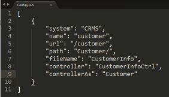

2016/08/30 

# TEACH專案(Customer/Contract)講解

講師：Oliver

1. Entity.config 定義 => 早上第二個影片開頭
2. SourceHelper：用來連接資料庫和Service的連接器。

## AP段

1. 切換頁面都是依ui.router路由設定，使用$state做切換。

2. 一般路由設定
   

3. 虛擬路由設定

   | Key  | 說明   |
   | ---- | ---- |
   | name | 路由名稱 |
   | url  | 開啟網址 |
   | path | 實體路徑 |

   

   > 當切換的頁面很多時，利用虛擬路由做出 大 中 小 架構，對開發來說也較好認。

4. 使用AjaxService.Modify方法有四種：
   a. Modify 單一  b. ModifyList 多  c. BySql  d. BySPC 
   幾種狀況
   a. 如果沒有指定，都是BySql
   b. 如果使用Store Procedure (參數帶入Service用Store Procedure標籤定義的type名稱)，還是可以強制BySql，通常用在Update。
   
   ​

## Service－Entity.config

1. 整份Service專案底下，Service做分流；DataAccess、BusinessLogic 做資料存取

2. 使用 [虛擬] 的定義，與AP段不同 (用在路由)；
   [虛擬實體] 通常是拉出資料表 (ex: TB_TABLE_CONFIG) 特定某個值形成Key-Value的樣子 
   ex: 選擇欄位TB_NAME - CL_NAME，值取TB_TABLE_CONFIG - SEX 
   　  形成一個男女的實體，這樣的實體為虛擬實體。

3. entity要做關聯
   a. 一對一：relation標籤
   b. 一對多：relationPlan標籤

4. 如果看到流水編號SN出來是空值，檢查兩個地方並修正
   a. TB_SERIAL_NUMBER_CTL 新增相關設定
   b. 把TB_SERIAL_INFO 產生的錯誤資料刪掉

   另外，如果INSERT使用Store Procedure，那流水號產生器就要做在SPC裡面，SourceHelper不會再去讀Entity.config裡的serial標籤。

5. 做 Insert/Update 時，SourceHelper產生#TempTable有的彈性是，當傳入NULL變數，就不會放到#TempTable裡面。

6. StoreProcedure若要連接不同group的參數，可下 link
   

7. deleteTable 標籤

   - 下 conditions 時機在於該 key 在 keyMapping 裡面沒有。
   - 第二個 type="ContactParameter" 還沒有很懂，需再看影片。

   

## DataBase

1. 資料庫能處理NULL的方式不多，要盡量減少，例如範例使用PIVOT。

## 其他

1. gulp 目前對新增的檔案沒有反應。

2. SubLime工具的熟用：

   - 設定工具的程式碼片段。#參考FirstCodeTW
   - 全文Search

   ​

​

