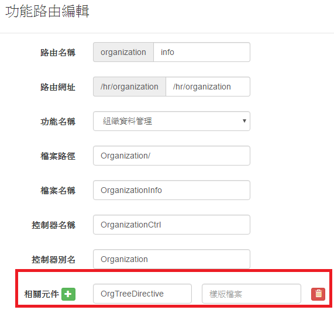

## Objective

关于今天的工作, 你记得什么?

- 解 bug
- 摸摸報支單簽核途程

完成了什么?

- SIT 測試
- 理出報支單簽核途程的順序

## Reflective

你要如何形容今天的情绪

- 悶

今天的高峰是什么?

- ​

今天的低点是什么?

- 囧

## Interpretive

我们今天学到了什么?

- 在專案的 html 如何呼叫到 其他 .js 檔？進去 LMS 打開該 html 的路由設定，下面的元件設定
  
- ​

今天一个重要的领悟是什么?

- ​

## Decisional

我们会如何用一句话形容今天的工作

- 煩

有哪些工作需要明天继续努力?

- ​

\2. 遇到生活中的「bug」，就是做錯的事，記下來

\* 為什麼會發生這個原因

\* 我做錯了什麼

\* 正確又該怎麼做
