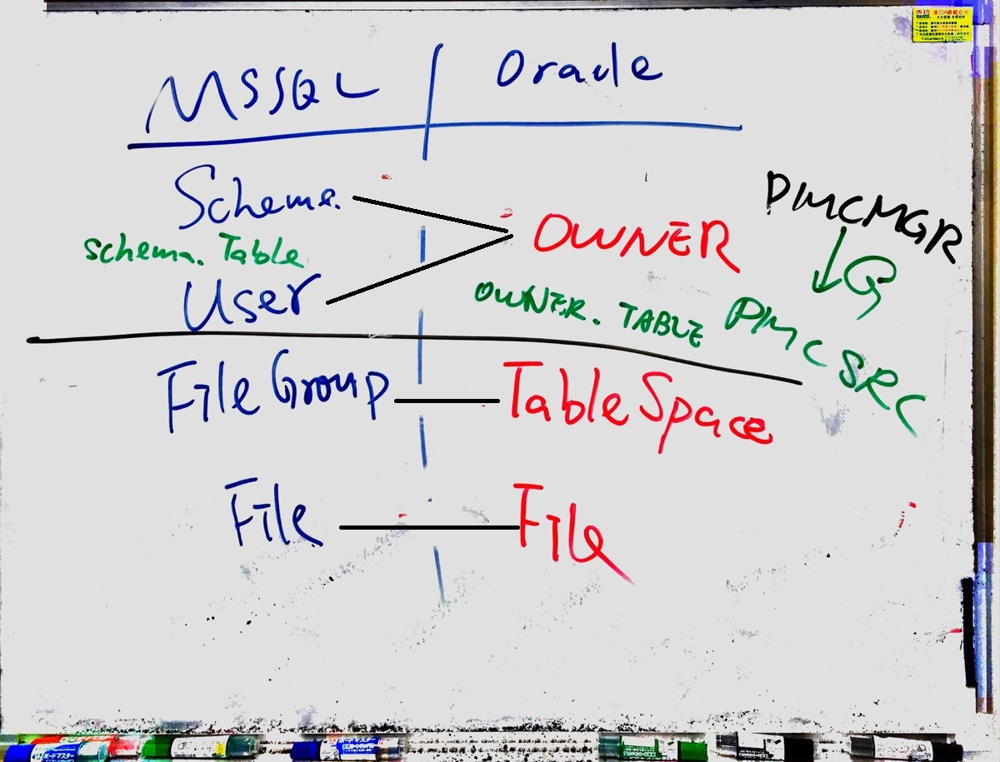
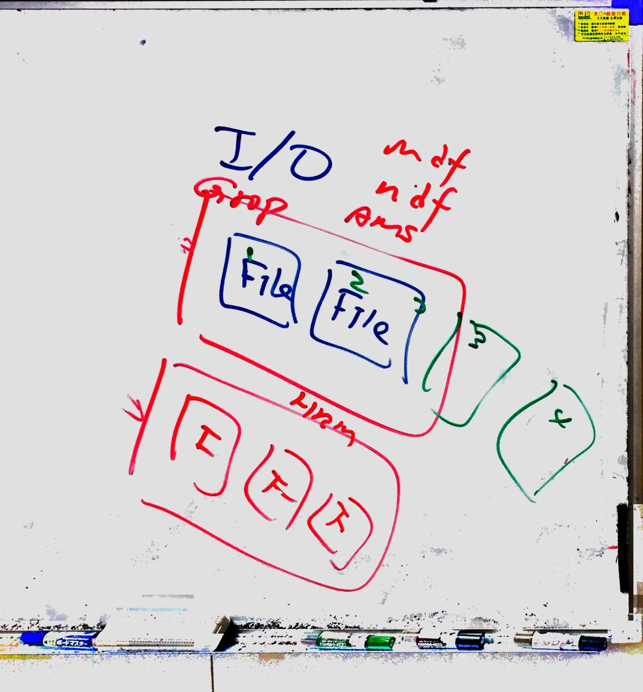

## Objective

### 關於今天的工作，你記得甚麼？

- 阿壹講解 MSSQL 和 Oracle 差別。
  不同於 MSSQL 將 Schema 和 User 分開設定，Oracle 在指定 User 的同時，也指定了 Schema。
  

- 阿壹講解 File Group 和 File 

  - File 檔案，是儲存體，真正儲存檔案的地方，對資料庫備份來說，可決定單拿該 File 即可。
  - File Group 檔案群組，是種無形的邏輯架構 (預設是 PRIMARY，其他比如專案的 AMS、HRMS)，可擁有多個 File。做這樣的配置是為了效能。

  

- 阿壹講解 mdf / ndf / ldf 檔案結構

  - mdf：主要資料庫名稱
  - ndf：放置 (切割成) 不同的 File。若備份只想取單獨一份，就可方便地取該份 File。
  - ldf：交易檔，在完全備份以前，這份交易檔就很重要。完全備份後，交易檔會被清掉。

  ​
  

- 與恆豐玫文討論資料表關聯。

### 完成了甚麼？

- 確認恆豐排箱用到的資料表關聯，與原先推想的相同。
- 文件中，恆豐排箱取用資料表 SYPARTPD 的資料要透過工單、客戶資料檔、SYSHOECT各自一個欄位當作「條件」以便取得正確的資料。
- 確認恆豐不同工廠用的ERP，裡面的資料表都是相同。
- 恆豐移動資料庫的作法，是先備份一份完全相同的做修改，改完再 Drop 原來的，用新的取代。

------

## Reflective

### 你要如何形容今天的情绪

- 不錯

### 今天的高峰是甚麼?

- 確認推演的資料表關聯與玫文相同。
- 拿到員工旅遊的高鐵票。

### 今天的低點是甚麼?

- 無

------

## Interpretive

### 今天學到了甚麼?

- 想要處理/面對資料庫的效能問題，資料庫的檔案結構就需要多了解。

### 今天一個重要的領悟是甚麼?

- 技術知識是慢慢堆出來的。

------

## Decisional

### 我們會如何用一句話形容今天的工作?

- 有很多關於資料庫知識上的收穫。

### 有那些工作需要明天繼續努力?

- 準備員工旅遊。

### 遇到生活中的「bug」，就是做錯的事，記下來

- 把記憶體跟資料庫儲存體混為一談。

### 為什麼會發生這個原因

- 太急了。
- 名詞沒有分清楚。

### 我做錯了什麼

- 將名詞搞混。

### 正確又該怎麼做

- 記憶體不是永久存取的空間。
- 儲存體是 I/O 要寫入硬碟的空間大小。就硬碟...